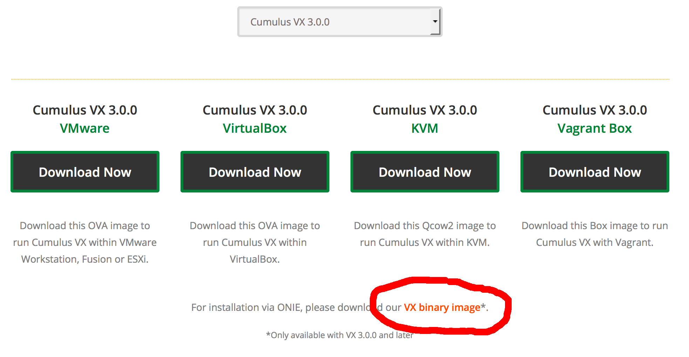

onie-vagrant
============
This is a project for deploying the [Open Networking Install Environment](http://onie.org)
using [Vagrant](http://vagrantup.com) to quickly deploy accurate simulations of
data center networks for educational, testing, and prototyping purposes. The
ONIE Vagrant box simulates a factory-reset white box switch, on which a
compatible network operating system such as [Cumulus Linux](http://cumulusnetworks.com)
can be installed. This Vagrant box is compatible with the ONIE installer image
for [Cumulus VX](https://cumulusnetworks.com/cumulus-vx/)

### Useful Links
 * ONIE base box on Hashicorp: https://atlas.hashicorp.com/isharacomix/boxes/onie
 * Download Cumulus VX: https://cumulusnetworks.com/cumulus-vx/

Usage
-----
  * Install Vagrant
  * Download an ONIE Installer Image
  * Write a Vagrantfile that uses

Installing Vagrant
------------------
The following steps work on an Ubuntu 14.04 machine. For more information or
other platforms, read the
[Vagrant installation instructions](https://www.vagrantup.com/docs/installation/).
I recommend installing the vagrant scp plugin as well to quickly move files on
and off virtual machines.

    wget https://releases.hashicorp.com/vagrant/1.9.0/vagrant_1.9.0_x86_64.deb
    sudo dpkg -i vagrant_1.9.0_x86_64.deb
    vagrant plugin install vagrant-scp

Getting an ONIE Installer Image
-------------------------------
### Cumulus VX
Cumulus VX is the free version of Cumulus Linux used for Virtual Machines.
Since VX 3.0.0, Cumulus Networks provides an ONIE installer image that can
be used to install VX on a Virtual Machines running ONIE.

Create an account on the [Cumulus Networks](http://cumulusnetworks.com) and
visit the [Cumulus VX](https://cumulusnetworks.com/cumulus-vx/) download page.
Choose a desired version (starting at 3.0.0) and download the Cumulus VX
binary image.

Running the Examples
--------------------
There are three examples.

 * **onie-nos-install**: Do this demo first. This shows a manual installation
   of Cumulus Linux by putting the `onie-installer` image directly on the
   device.
 * **dhcp-install**: Do this demo second. This shows how to do an unattended
   installation of Cumulus Linux on an ONIE switch using DHCP and Apache.
 * **spine-leaf**: Do this demo last. This shows an unattended installation
   of Cumulus Linux across a two-tier CLOS topology. Explains everything needed
   to build Vagrantfiles, preseed files, and configuration needed to create
   custom topologies.
